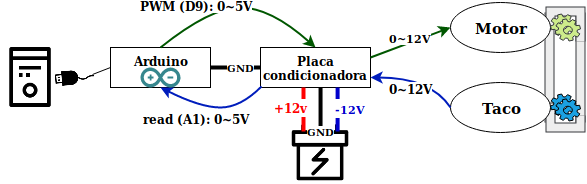
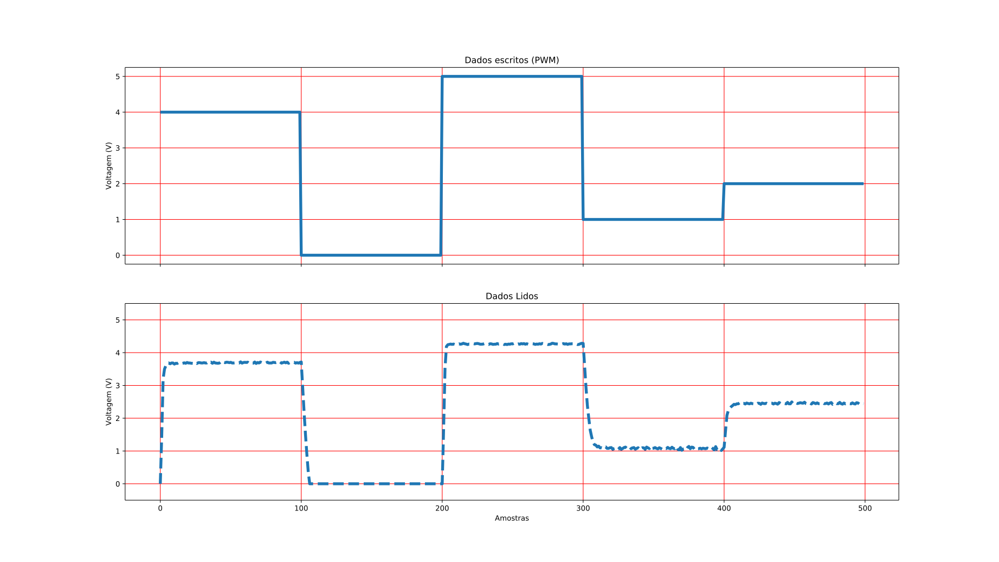
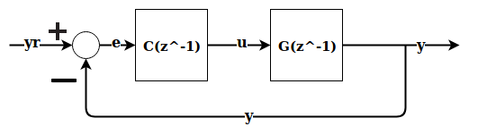

# Projetos de compensadores em python

Este projeto foi realizado como trabalho final da cadeira de **Sistemas de controle** no curso *Engenharia de Computação* pela **Universidade Estadual do Rio Grande do Sul**. Realizado entre maio e julho de 2019.

O trabalho foi desenvolvido pelos alunos e avaliado pelo professor indicado na tabela abaixo.

| Atribuição        | Responsabilidade       | Nome                             | e-mail                            |
| -----             | ----------------       | -----------                      | ---------                         |
| Aluno             | Autor                  | `João Gustavo Atkinson Amorim`   | `joaogustavoamorim@gmail.com`     |
| Aluno             | Autor                  | `Lucas Silva Ennes`              | `lucassilvaennes@gmail.com`       |
| Professor         | Co-autor               | `Rodrigo Iván Goytia Mejia`      | `rodrigo-mejia@uergs.edu.br`      |

## Informações
Este trabalho consiste em realizar os projetos de controladores de avanço e atraso para uma planta motor-taco gerador. As conexões entre os partes do projeto pode ser visto abaixo.

  

O sistema funciona da seguinte maneira:

1. Computador envia sinal de escrita ao pino PWM configurado (D9), um valor entre 0 e 1.
2. O arduino escreve o PWM entre 0 e 5V.
3. A placa condionadora recebe o sinal do PWM e amplica para o sinal ficar entre 0 e 12V para ser enviado ao motor.
4. Motor DC recebe a tensão condionada e gira o motor, fazendo que a correia entre o motor e o taco comece a girar.
5. O taco gera energia entre 0 e 12V atraves da rotação que lhe é concedida pela correia.
6. A tensão gerada pelo taco é enviada a placa condionada onde é reamostrada para ficar entre 0 e 5V, através de ajustes de zero e span.
7. O computador envia um sinal para o arduino ler através de um pino (A1) a tensão condicionada do taco.

Com estas conexões realizadas é possivel aplicar uma malha de controle no loop do código que realiza a leitura e escrita dos dados do arduino. Mas primeiro é importante mostrar o por que seria nescessario uma malha de controle. Isto pode ser visto analizando a figura abaixo

  

O grafico superior é referente a entrada aplicada ao motor, escrita pelo PWM e o inferior é os valores lidos gerados pelo taco. Percebe-se que a planta possui dificuldade em seguir a referencia de entrada, e analizando os valores obtidos pode perceber que não é apenas um comportamento por erro de de incremento de sinal. Analizando mais precisamente a saida com a referencia em 4V (entre as amostras 0 e 100) nossa planta nos gera uma saída de menos de 4V, já olhando para a referencia em 2V (amostras entre 400 e 500) percebe-se que a planta possui está retornando um valor superior a 2V cerca de 2.5V.

Visto que o funcionamento da planta nescessitaria de um compensador, podemos modelar nosso sistema da seguinte forma:

  

Sendo que a resposta vista anteriormente consistem em $C(Z^{-1} = 1)$. Então **o objetivo** deste trabalho é encontrar modelos de $C(z^{-1})$ que realizem o controle do sinal de maneira que controle nossa planta $G(z^{-1})$, lembrando que nossa Planta $G(z^{-1})$ é referente ao sistema motor-taco montado e mostrado anteriormente. Podemos demostrar deste modelo determinado:

* $e(k) = y_r(k) - y(k)$, ou seja o erro atual do nosso modelo,  sendo k referente ao numero de amostra
* $C(z^{-1}) = \frac{u}{e}$
  * Se considerarmos que nosso controlador será de primeira ordem podemos dizer então que:
    *  $C(z^{-1}) = \frac{u(k)}{e(k)} = \frac{b_0+b_1 * z^{-1}}{1+a_1 * z^{-1}}$
       * logo pode-se dizer que $u(k) = b_0 * e(k) + b_1 * e(k-1)-a_1 * u(k-1)$ sendo k referente ao numero de amostra
  * Se considerarmos que nosso controlador será de segunda ordem podemos dizer então que:
    *  $C(z^{-1}) = \frac{u(k)}{e(k)} = \frac{b_0 + b_1 * z^{-1} + b_2 *  z^{-2}}{1 + a_1 * z^{-1} + a_2 * z^{-2}}$
       * logo pode-se dizer que $u(k) = b_0 * e(k) + b_1 * e(k-1) + b_2 * e(k-2) - a_1 * u(k-1) - a_2 * u(k-2)$ sendo k referente ao numero de amostra
* O valor de y(k) será gerado pelo taco e lido pelo arduino, é o valor mostrado no grafico inferior da figura 2.
  * O valor de u(k) utilizado para gerar é o valor mostrado no grafico superior da figura 2.

Ao longo deste trabalho então será projetado controladores em avanço, atraso, avanço-atraso por lugar das raizes e por resposta em frequencia. Ou seja, determinar os melhores valores de $b_n$ e $a_n$ de forma que corrija o erro visto na figura 2.

Para implementação e teste dos controladores elaborados, $y_r(k)$ será algo similar ao valor de u(k) utilizado na figura 2. Então os valores de $u(k)$ serão calculados conforme o controlador implementado.

Os controles elaborados podem ser vistos em [Controles/](./Controles/) onde possui os dados da elaboração do mesmo, assim como os resultados em simulação e testando na planta real.
## Instalação
Para realizar o download dos arquivos do projeto pode ser possivel utilizando o git com o seguinte comando:
> git clone https://github.com/johnnv1/compensator_projects.git

Utilizando o pip do python3/*pip3* para instalar as bibliotecas utilizadas para utilização do python para realizar os projetos.
> pip install -r Python-codes/requeriments.txt

Para utilizar o arduino de maneira direta pelo python, como por exemplo escrever e ler diretamente os seus pinos é nescessario gravar um código/sketchbook em sua memória antes da utilização dos códigos python. O sketchbook utilizado é o [StandardFirmata](https://www.arduino.cc/en/Reference/Firmata) que é o responsavel por realizar o protocolo de comunicação entre o computador e o arduino. Seu código pode ser encontrado na pasta [Arduino-codes/StandardFirmata/](./Arduino-codes/StandardFirmata/) normalmente ele se encontra também nos exemplos do [Arduino IDE](https://www.arduino.cc/en/Main/Software), podendo ser acessado da seguinte maneira dentro da IDE:
> Arquivo -> Exemplos -> Firmata -> StandardFirmata

Após carregar o arquivo do StandardFirmata no arduino IDE basta compilalo e envia-lo para o arduino. Obs.: não é nescessario que este procedimento seja feito pelo arduino IDE, porém é o caminho mais facil a usuarios de menor conhecimento.

## Documentação

blablabla

### Lista de abreviaturas
| abreviatura       | Significado       |
| -----             | -----             |
| `MA`              | `Malha aberta`                |
| `MF`              | `Malha fechada`                |
| `cav`             | `Controlador em avanço`                |
| `cat`             | `Controlador em atraso`                |
| `lr`              | `lugar das raizes`                |
| `rf`              | `resposta em frequencia`                |
| `cavlr`           | `Controlador em avanço por lugar das raizes`                |
| `catlr`           | `Controlador em atraso por lugar das raizes`                |
| `cavatlr`         | `Controlador em avanço-atraso por lugar das raizes`                |
| `cavrf`           | `Controlador em avanço por resposta em frequencia`                |
| `catrf`           | `Controlador em atraso por resposta em frequencia`                |
| `cavatrf`         | `Controlador em avanço-atraso por resposta em frequencia`                |

### Estruturas do projeto

* Na pasta [Python-codes/](./Python-codes/) possui os códigos escritos em python baseados nos exercicios realizados em MATLAB durante as aulas. Estes códigos em python foram também uma tentativa de escrita de projetos de controladores o mais automatizado possivel. E foram utilizados para obter os controladores finais deste trabalho.
  * No arquivo [Trabalho_final_sistemas_de_controle.ipynb](./Trabalho_final_sistemas_de_controle.ipynb) foi realizado um jupyter notebook como rascunho deste projeto desenvolvido.
  * No arquivo [makeControlOrd1.py](./makeControlOrd1.py) é desenvolvido os controladores realizados para a aproximação de **primeira** ordem da planta. 
  * No arquivo [makeControlOrd2.py](./makeControlOrd2.py) é desenvolvido os controladores realizados para a aproximação de **segunda** ordem da planta.
  * Na pasta [core/](./core/) encontra-se os arquivos com as funções utilizadas ao longo do trabalho
    * Arquivo [cavlr.py](./core/cavlr.py) monta o controlador em avanço por lugares das raizes
    * Arquivo [catlr.py](./core/catlr.py) monta o controlador em atraso por lugares das raizes
    * Arquivo [cavatlr.py](./core/catavlr.py) monta o controlador em avanço e atraso por lugares das raizes
    * Arquivo [cavrf.py](./core/cavrf.py) monta o controlador em avanço por resposta em frequencia
    * Arquivo [catrf.py](./core/catrf.py) monta o controlador em atraso por resposta em frequencia
    * Arquivo [cavatrf.py](./core/catavrf.py) monta o controlador em avanço e atraso por resposta em frequencia
    * Arquivo [misc.py](./core/misc.py) possui uma miscelânea de funções utilizadas ao longo do projeto
* Na pasta [MATLAB-codes/](./MATLAB-codes/) possui codigos matlabs que envolvem o trabalho
* Na pasta [Dados-de-leitura/](./Dados-de-leitura/) possui arquivos *csv* com os dados lidos pelo arduino e esses dados plotados nos arquivos *svg*
* Na pasta [Controles/](./Controles/) possui arquivos referente aos controladores projetados